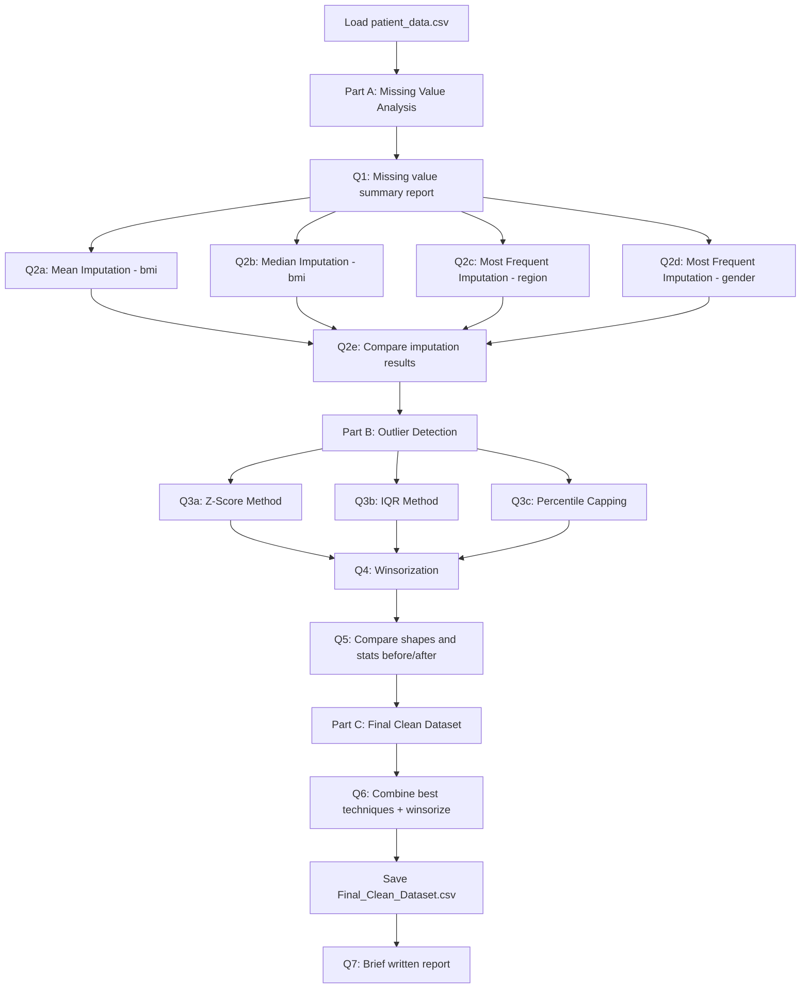

# 🧹 Data Cleaner


---

# 📖 Project Overview

**Data Cleaner** is a data preprocessing project built with **Python** and **Jupyter Notebook** that focuses on handling **missing values** and **outliers** in a real-world style patient health dataset.

The project combines **theoretical imputation/outlier-handling techniques** with **practical implementation** on `patient_data.csv`. Multiple missing-value imputation strategies (mean, median, most-frequent) and multiple outlier-handling techniques (Z-score, IQR, percentile capping, Winsorization) are applied, compared, and finally combined into a single cleaning pipeline that produces a ready-to-use, analysis-ready dataset.

This project demonstrates how proper data cleaning improves data quality and reliability before any statistical analysis or machine learning model is built on top of it.

🎥 **Video Walkthrough:** [Watch here](https://YOUR-VIDEO-LINK-HERE)

---

# 🎯 Objectives

The main objectives of this project are:

- 🧹 Understand different missing-value imputation techniques.
- 📊 Identify and quantify missing data in a dataset.
- 📈 Compare imputation strategies (mean, median, most-frequent).
- 🔍 Detect outliers using multiple statistical methods.
- 📉 Compare outlier-handling techniques (removal vs. capping).
- 📐 Build a final, fully-cleaned dataset from the best techniques.
- 💻 Perform the entire workflow using Python.
- 🚀 Improve data quality, consistency, and usability.
- 📑 Present results clearly with summaries and comparisons.

---

# ✨ Project Features

- ✅ Missing Value Detection & Summary Report
- ✅ Mean Imputation
- ✅ Median Imputation
- ✅ Most Frequent (Mode) Imputation
- ✅ Z-Score Outlier Detection
- ✅ IQR Outlier Detection
- ✅ Percentile Capping
- ✅ Winsorization
- ✅ Before vs. After Comparison
- ✅ Final Cleaned Dataset Export (CSV)
- ✅ Python Implementation
- ✅ Statistical Interpretation

---

# 🔄 Project Workflow



---

# 📁 Dataset Information

**Dataset Name**

```text
patient_data.csv
```

The dataset contains patient health records used throughout this project to perform missing-value imputation and outlier-handling experiments. It is the foundation for all tasks in Part A, B, and C.

---

# 📋 Dataset Columns

| Column Name | Description |
|--------------|-------------|
| patient_id | Unique patient identifier |
| age | Patient age |
| gender | Male / Female |
| region | North / South / East / West |
| bmi | Body Mass Index |
| blood_pressure | Blood pressure reading |
| cholesterol | Cholesterol level |
| glucose | Glucose level |
| disease_risk | Target label (0 / 1) |

---

# 🛠️ Libraries Used

```python
import pandas as pd
import numpy as np

# Visualization
import matplotlib.pyplot as plt
import seaborn as sns

# Simple Imputer
from sklearn.impute import SimpleImputer

# KNN Imputer
from sklearn.impute import KNNImputer

# MICE
from sklearn.experimental import enable_iterative_imputer
from sklearn.impute import IterativeImputer

# For Random Imputation
import random

# For Z score
from scipy.stats import zscore

# For winsorize
from scipy.stats.mstats import winsorize
```

---

# ⚙️ Purpose of Each Library

| Library | Purpose |
|----------|---------|
| **Pandas** | Data loading, cleaning, and manipulation |
| **NumPy** | Numerical calculations and array operations |
| **Matplotlib / Seaborn** | Visualizing distributions and comparisons |
| **Scikit-learn (SimpleImputer, KNNImputer, IterativeImputer)** | Missing value imputation strategies |
| **SciPy (zscore, winsorize)** | Outlier detection and treatment |

---

# 📚 Practical Tasks

The following tasks are performed in this notebook:

✅ Task 1 – Identify missing values and provide a summary report

✅ Task 2 – Compare mean, median, and most-frequent imputation strategies

✅ Task 3 – Detect outliers using the Z-Score method

✅ Task 4 – Detect outliers using the IQR method

✅ Task 5 – Cap outliers using the Percentile method

✅ Task 6 – Cap outliers using Winsorization

✅ Task 7 – Compare dataset shape and statistics before vs. after outlier handling

✅ Task 8 – Build the final cleaned dataset and export it

---

# 1️⃣ Task 1 – Identify Missing Values and Provide a Summary Report

## 📖 Explanation

The first step in any cleaning pipeline is to understand how much data is missing and where. This task counts missing values per column, converts the counts to percentages, and builds a summary table so the scale of the problem is clear before choosing an imputation strategy.

---

## 🎯 Objective

- Load the dataset.
- Count missing values per column.
- Calculate missing value percentage per column.
- Build a summary report.
- Calculate the total number of missing values.

---

## 💻 Python Code

```python
# Load Dataset
df = pd.read_csv("patient_data.csv")

# Display First 5 Rows
print(df.head())

# Dataset Shape
print(df.shape)

# Missing value in each column
print(df.isnull().sum())

# Percentage of missing value
missing_per = (df.isnull().sum()) / len(df) * 100

# Summary report
summary = pd.DataFrame({
    "Missing Value": df.isnull().sum(),
    "Percentage (%)": missing_per.round(2)
})
print(summary)

# Total Missing Value
print(df.isnull().sum().sum())
```

## 📊 Interpretation

- `bmi` has the highest number of missing values (12, 6.0%), followed by `region` (11, 5.5%) and `age` (10, 5.0%).
- `patient_id`, `blood_pressure`, and `disease_risk` have no missing values.
- Since missingness is under 10% per column, imputation is a reasonable strategy (rather than dropping rows).

---

## ✅ Conclusion

The summary report confirms the dataset has scattered but manageable missing data across six columns, making it a good candidate for imputation-based cleaning rather than row deletion.

---

# 2️⃣ Task 2 – Compare Mean, Median, and Most Frequent Imputation

## 📖 Explanation

Different columns need different imputation strategies. Numeric columns like `bmi` can use **mean** or **median** imputation, while categorical columns like `region` and `gender` require **most frequent (mode)** imputation. This task applies each strategy separately, then compares the results side by side.

---

## 🎯 Objective

- Apply Mean Imputation on `bmi`.
- Apply Median Imputation on `bmi`.
- Apply Most Frequent Imputation on `region`.
- Apply Most Frequent Imputation on `gender`.
- Compare missing-value counts across all approaches.

---

## 📐 Formula

**Mean**

$$
\bar{x}=\frac{\sum_{i=1}^{n}x_i}{n}
$$

**Median** — the middle value of the sorted data (robust to outliers, unlike the mean).

**Mode** — the most frequently occurring category in the column.

---

## 💻 Python Code

```python
# Q2(a) Mean Imputation for BMI
df_mean = df.copy()
mean_imputer = SimpleImputer(strategy="mean")
df_mean["bmi"] = mean_imputer.fit_transform(df_mean[["bmi"]])

# Q2(b) Median Imputation for BMI
df_median = df.copy()
median_imputer = SimpleImputer(strategy="median")
df_median["bmi"] = median_imputer.fit_transform(df_median[["bmi"]])

# Q2(c) Most Frequent Imputation for Region
df_region = df.copy()
region_imputer = SimpleImputer(strategy="most_frequent")
df_region["region"] = region_imputer.fit_transform(df_region[["region"]]).ravel()

# Q2(d) Most Frequent Imputation for Gender
df_gender = df.copy()
gender_imputer = SimpleImputer(strategy="most_frequent")
df_gender["gender"] = gender_imputer.fit_transform(df_gender[["gender"]]).ravel()

# Q2(e) Compare Results
comparison = pd.DataFrame({
    "Original": df.isnull().sum(),
    "Mean (BMI)": df_mean.isnull().sum(),
    "Median (BMI)": df_median.isnull().sum(),
    "Region Imputed": df_region.isnull().sum(),
    "Gender Imputed": df_gender.isnull().sum()
})
print(comparison)
```

## 📊 Interpretation

- Mean imputation (BMI ≈ 29.50) is sensitive to outliers, since BMI has a right-skewed spread.
- Median imputation (BMI = 28.25) is more robust and less affected by extreme values.
- Most-frequent imputation works well for categorical fields since it preserves the dominant category distribution.

---

## ✅ Conclusion

Median imputation is preferred for `bmi` due to the presence of outliers, while most-frequent imputation is the natural choice for the categorical `region` and `gender` columns.

---

# 3️⃣ Task 3 – Detect Outliers Using the Z-Score Method

## 📖 Explanation

The **Z-Score method** measures how many standard deviations a value is from the mean. It is applied here to `cholesterol` and `glucose` to flag values that are statistically unusual (|Z| > 3), which are then removed from the dataset.

---

## 🎯 Objective

- Calculate Z-scores for `cholesterol` and `glucose`.
- Flag values with |Z| > 3 as outliers.
- Remove flagged outliers.
- Compare dataset shape before and after.

---

## 📐 Formula

$$
Z=\frac{X-\mu}{\sigma}
$$

Where **X** is the value, **μ** is the mean, and **σ** is the standard deviation.

---

## 💻 Python Code

```python
df_zscore = df.copy()

chol_mean = df_zscore["cholesterol"].mean()
chol_std = df_zscore["cholesterol"].std()

glu_mean = df_zscore["glucose"].mean()
glu_std = df_zscore["glucose"].std()

# Manual Z-score Formula
df_zscore["chol_zscore"] = (df_zscore["cholesterol"] - chol_mean) / chol_std
df_zscore["glucose_zscore"] = (df_zscore["glucose"] - glu_mean) / glu_std

# Detect Outliers
outliers = df_zscore[
    (abs(df_zscore["chol_zscore"]) > 3) |
    (abs(df_zscore["glucose_zscore"]) > 3)
]
print(outliers[["patient_id", "cholesterol", "glucose", "chol_zscore", "glucose_zscore"]])

# Remove Outliers
df_zscore = df_zscore[
    (abs(df_zscore["chol_zscore"]) <= 3) &
    (abs(df_zscore["glucose_zscore"]) <= 3)
]
print(df_zscore.shape)
```

## 📊 Interpretation

- The Z-score method is best suited to roughly normal, symmetric data.
- It is sensitive to `NaN` values — rows with missing `cholesterol`/`glucose` fall out of the filtered result.
- No extreme statistical outliers (beyond 3 standard deviations) were found in this dataset.

---

## ✅ Conclusion

The Z-score check confirms `cholesterol` and `glucose` don't contain extreme statistical outliers, though care is needed since missing values interact with the filtering logic.

---

# 4️⃣ Task 4 – Detect Outliers Using the IQR Method

## 📖 Explanation

The **Interquartile Range (IQR) method** defines outlier boundaries using the spread between the 25th and 75th percentiles. It is a distribution-free method, meaning it doesn't assume the data is normally distributed — making it a good fit for `bmi`.

---

## 🎯 Objective

- Calculate Q1, Q3, and IQR for `bmi`.
- Compute lower and upper bounds.
- Detect and remove values outside the bounds.
- Report the resulting dataset shape.

---

## 📐 Formula

$$
IQR=Q3-Q1
$$

$$
\text{Lower Bound}=Q1-1.5\times IQR
$$

$$
\text{Upper Bound}=Q3+1.5\times IQR
$$

---

## 💻 Python Code

```python
df_iqr = df.copy()

Q1 = df_iqr["bmi"].quantile(0.25)
Q3 = df_iqr["bmi"].quantile(0.75)
IQR = Q3 - Q1

lower = Q1 - 1.5 * IQR
upper = Q3 + 1.5 * IQR

print("Lower Limit :", lower)
print("Upper Limit :", upper)

outliers = df_iqr[(df_iqr["bmi"] < lower) | (df_iqr["bmi"] > upper)]
print("Number of BMI Outliers :", len(outliers))

df_iqr = df_iqr[(df_iqr["bmi"] >= lower) & (df_iqr["bmi"] <= upper)]
print("Dataset Shape :", df_iqr.shape)
```

## 📊 Interpretation

- All observed `bmi` values fall well within the IQR bounds — no extreme outliers.
- Like the Z-score method, the IQR filter implicitly drops rows with missing `bmi`.
- IQR is a robust, assumption-free way to sanity-check the spread of a numeric column.

---

## ✅ Conclusion

The IQR check shows `bmi` values are well-behaved with no statistical outliers, reinforcing that median imputation plus light capping is sufficient treatment for this column.

---

# 5️⃣ Task 5 – Cap Outliers Using the Percentile Method

## 📖 Explanation

Instead of removing rows, the **Percentile method** caps (clips) extreme values at the 1st and 99th percentile. This keeps all records in the dataset while limiting the influence of extreme values.

---

## 🎯 Objective

- Calculate the 1st and 99th percentile of `bmi`.
- Clip values outside this range.
- Inspect the resulting distribution.

---

## 📐 Formula

$$
X_{capped}=\min(\max(X, P_1), P_{99})
$$

Where **P₁** and **P₉₉** are the 1st and 99th percentile values.

---

## 💻 Python Code

```python
df_percentile = df.copy()

lower = df_percentile["bmi"].quantile(0.01)
upper = df_percentile["bmi"].quantile(0.99)

df_percentile["bmi"] = df_percentile["bmi"].clip(lower, upper)
print(df_percentile["bmi"].describe())
```

## 📊 Interpretation

- Unlike Z-score/IQR removal, percentile capping preserves the row count.
- Extreme high/low `bmi` values are pulled toward the 1st/99th percentile instead of being discarded.
- This is a gentler outlier treatment, useful when every patient record matters.

---

## ✅ Conclusion

Percentile capping is an effective, non-destructive way to limit the influence of extreme `bmi` values while keeping the full dataset intact.

---

# 6️⃣ Task 6 – Cap Outliers Using Winsorization

## 📖 Explanation

**Winsorization** is closely related to percentile capping — it replaces the smallest and largest values with the nearest values within a specified percentile limit, using `scipy.stats.mstats.winsorize`. It's applied here to `bmi` with 1% limits on each tail.

---

## 🎯 Objective

- Apply Winsorization to `bmi` with 1%/1% limits.
- Inspect summary statistics after treatment.
- Compare against the original and other outlier methods.

---

## 💻 Python Code

```python
df_win = df.copy()

df_win["bmi"] = winsorize(df_win["bmi"], limits=[0.01, 0.01])
print(df_win["bmi"].describe())
```

## 📊 Interpretation

- Winsorization produces results very close to percentile capping since both target the same 1%/1% tails.
- The dataset size stays at 200 rows — no data is discarded.
- This method is well suited when preserving sample size matters more than removing every possible extreme value.

---

## ✅ Conclusion

Winsorization is the preferred outlier treatment for this project because it keeps every patient record while still controlling the effect of extreme `bmi` values.

---

# 7️⃣ Task 7 – Compare Dataset Shape and Statistics Before vs. After

## 📖 Explanation

This task consolidates the results of all three outlier-handling techniques (Z-score, IQR, Winsorization) so their trade-offs can be compared directly — specifically how each affects dataset size and summary statistics.

---

## 🎯 Objective

- Compare dataset shape across the original data and each outlier method.
- Compare `describe()` statistics before and after Winsorization.

---

## 💻 Python Code

```python
print("Original Dataset Shape:", df.shape)
print("After Z-score:", df_zscore.shape)
print("After IQR:", df_iqr.shape)
print("After Winsorization:", df_win.shape)

print(df.describe())
print(df_win.describe())
```

## 📊 Interpretation

- Z-score and IQR both **reduce row count** (removal-based methods, and they implicitly drop rows with missing values).
- Winsorization **preserves all 200 rows**, only adjusting extreme values.
- Summary statistics (mean, std, quartiles) stay nearly identical before/after Winsorization — confirming it doesn't distort the overall distribution.

---

## 📌 Comparison

| Z-Score / IQR (removal) | Winsorization (capping) |
|---|---|
| Reduces row count | Preserves row count |
| Can lose valid data | Keeps every patient record |
| Sensitive to missing values | Works directly on the column |
| Good for strict outlier exclusion | Good for gentle, non-destructive treatment |

---

## ✅ Conclusion

Comparing the three methods confirms Winsorization is the best fit for this dataset — it controls extreme values without losing any patient records, unlike the removal-based Z-score and IQR approaches.

---

# 8️⃣ Task 8 – Build the Final Cleaned Dataset

## 📖 Explanation

The final task combines the best-performing technique from each earlier experiment into a single, complete cleaning pipeline: median/mode/mean imputation for missing values, plus Winsorization for `bmi` outliers. The result is exported as a ready-to-use CSV.

---

## 🎯 Objective

- Fill missing values using the most appropriate strategy per column.
- Apply Winsorization to `bmi`.
- Confirm zero missing values remain.
- Export the final cleaned dataset.

---

## 💻 Python Code

```python
df_clean = df.copy()

# Fill Missing Values
df_clean["bmi"] = df_clean["bmi"].fillna(df_clean["bmi"].median())
df_clean["region"] = df_clean["region"].fillna(df_clean["region"].mode()[0])
df_clean["gender"] = df_clean["gender"].fillna(df_clean["gender"].mode()[0])
df_clean["age"] = df_clean["age"].fillna(df_clean["age"].mean())
df_clean["cholesterol"] = df_clean["cholesterol"].fillna(df_clean["cholesterol"].mean())
df_clean["glucose"] = df_clean["glucose"].fillna(df_clean["glucose"].mean())

# Winsorization on BMI
from scipy.stats.mstats import winsorize
df_clean["bmi"] = winsorize(df_clean["bmi"], limits=[0.01, 0.01])

print(df_clean.head())
print(df_clean.isnull().sum())
print(df_clean.shape)

# Save Dataset
df_clean.to_csv("Final_Clean_Dataset.csv", index=False)
print("Final Dataset Saved Successfully!")
```

## 📊 Interpretation

- Every column now has complete data — no `NaN` values remain.
- Row count is unchanged from the original (200 patients preserved).
- The dataset is now ready for exploratory analysis or machine learning.

---

## ✅ Conclusion

The final cleaning pipeline produces a complete, consistent dataset by combining median/mode/mean imputation with Winsorization — the best-performing technique identified in the earlier comparison tasks.

---

# 📝 Final Conclusion (Q7 – Brief Report)

**1. Which imputation strategy was most effective?**
Median imputation was most effective for `bmi` because the dataset contained outliers. Most-frequent imputation worked well for the categorical columns (`gender` and `region`).

**2. Which outlier handling method preserved data quality best?**
Winsorization preserved data quality best — it capped extreme values instead of removing patient records, keeping the dataset size unchanged.

**3. How did data cleaning improve dataset usability?**
Data cleaning removed missing values and handled outliers, resulting in a complete and consistent dataset. This improves the accuracy and reliability of downstream data analysis and machine learning models.

---

# ▶️ How to Run

1. Place `patient_data.csv` in the same directory as the notebook.
2. Open `Data_cleaner.ipynb` in Jupyter Notebook / JupyterLab.
3. Run all cells in order (Part A → Part B → Part C).
4. The cleaned output is written to `Final_Clean_Dataset.csv` in the same folder.

---

# 🎥 Project Demonstration

Watch the project demonstration video here:

👉 [▶️ Watch the Video](https://YOUR-VIDEO-LINK-HERE)

---

# 👨‍💻 Author

**Darshil**

- 🎓 Data Cleaning & Preprocessing Project
- 🐍 Python | Jupyter Notebook | Pandas | Scikit-learn | SciPy
- 📊 GitHub Portfolio Project

If you found this project helpful, don't forget to ⭐ star the repository!
