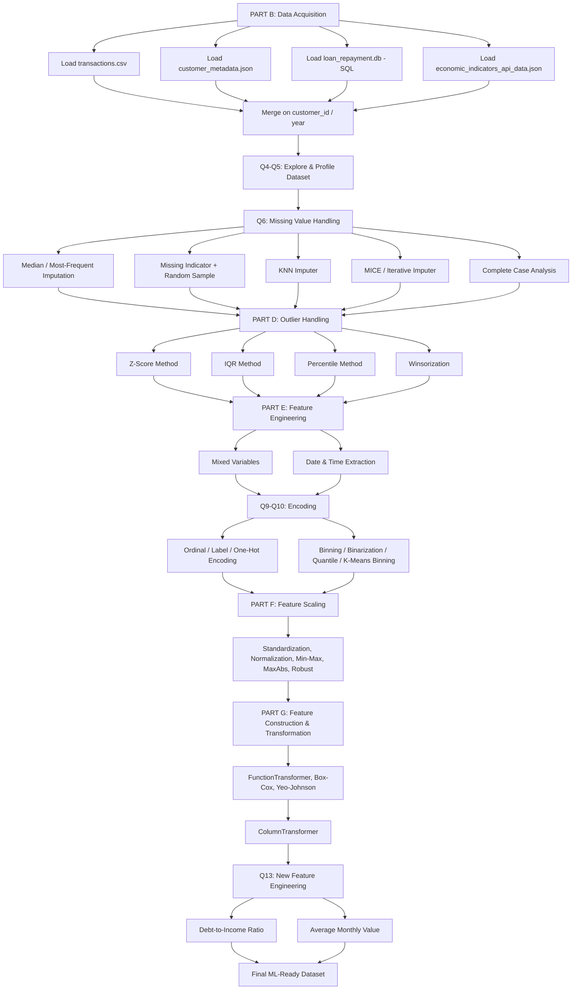

# 💳 Financial Data Preprocessing Pipeline


---

# 📖 Project Overview

**Financial Data Preprocessing Pipeline** is an end-to-end data preprocessing project built with **Python** and **Jupyter Notebook** that prepares a multi-source financial dataset for machine-learning modeling.

The project pulls data from **four different sources** — transaction records (CSV), customer metadata (JSON), loan repayment history (SQL/SQLite), and macro-economic indicators (API/JSON) — merges them into a single dataset, and takes it through a complete cleaning pipeline: missing-value handling, outlier treatment, feature engineering, categorical & numerical encoding, scaling, distributional transformations, and a unified `ColumnTransformer`. The result is a dataset that is substantially more suitable for downstream ML modeling.

📊 **Preprocessing Report:** `Data_Preprocessing_Report.pdf`
📈 **Data Profiling Report:** `data_profling_report.html` (generated with Sweetviz)

---

# 🎯 Objectives

The main objectives of this project are:

- 🔗 Acquire and merge data from multiple heterogeneous sources (CSV, JSON, SQL, API).
- 🔍 Explore and profile the merged dataset.
- 🧹 Identify and handle missing values using multiple strategies.
- 📉 Detect and treat outliers using multiple statistical methods.
- 🛠️ Engineer new features from mixed and date/time variables.
- 🔢 Encode categorical and numerical variables using several techniques.
- 📐 Scale and transform numerical features to make them ML-ready.
- 🧩 Combine everything into a single `ColumnTransformer` pipeline.
- 💻 Perform the entire workflow using Python and scikit-learn.

---

# ✨ Project Features

- ✅ Multi-source data acquisition (CSV + JSON + SQL + API)
- ✅ Automated data profiling with Sweetviz
- ✅ 7 missing-value handling techniques (Median, Most-Frequent, Missing Indicator + Random Sampling, KNN, MICE, Complete Case Analysis)
- ✅ 4 outlier detection/treatment methods (Z-Score, IQR, Percentile Capping, Winsorization)
- ✅ Mixed-variable & date-time feature extraction
- ✅ Ordinal, Label, and One-Hot Encoding for categorical variables
- ✅ Binning, Binarization, Quantile Binning, and K-Means Binning for numerical variables
- ✅ 5 scaling techniques (Standardization, Normalization, Min-Max, MaxAbs, Robust)
- ✅ 5 distribution transformations (Log, Reciprocal, Square-Root, Box-Cox, Yeo-Johnson)
- ✅ Unified `ColumnTransformer` pipeline
- ✅ Engineered financial features: Debt-to-Income Ratio & Average Monthly Value
- ✅ Python + Jupyter Notebook implementation

---

# 🔄 Project Workflow



---

# 📁 Dataset Information

The project combines data from **four sources**, merged on `customer_id` (and `year` for the economic data):

| Source File | Format | Rows | Join Key |
|---|---|---|---|
| `transactions.csv` | CSV | 1,500 | `customer_id` |
| `customer_metadata.json` | JSON | 500 | `customer_id` |
| `loan_repayment.db` | SQLite (`loan_repayment` table) | 700 | `customer_id` |
| `economic_indicators_api_data.json` | JSON (API-style) | 7 (2020–2026, India) | `year` |

---

# 📋 Dataset Columns

**Transactions** (`transactions.csv`)

| Column | Description |
|---|---|
| transaction_id | Unique transaction identifier |
| customer_id | Foreign key to customer metadata |
| transaction_date | Date of the transaction |
| transaction_type | Payment / Transfer / etc. |
| transaction_amount | Value of the transaction |
| payment_method | Cash / Net Banking / etc. |
| merchant_category | Category of merchant (Healthcare, Other, ...) |

**Customer Metadata** (`customer_metadata.json`)

| Column | Description |
|---|---|
| customer_id | Unique customer identifier |
| age | Customer age |
| gender | Male / Female |
| city | Customer's city |
| occupation | Private / Self-Employed / etc. |
| education_level | Primary / Secondary / Graduate / Post-Graduate |
| annual_income | Customer's annual income |

**Loan Repayment** (`loan_repayment.db`)

| Column | Description |
|---|---|
| loan_id | Unique loan identifier |
| customer_id | Foreign key to customer metadata |
| loan_amount | Principal loan amount |
| emi_amount | Equated Monthly Installment |
| repayment_status | Status of repayment |
| days_late | Days the repayment was overdue |
| repayment_date | Date of repayment |

**Economic Indicators** (`economic_indicators_api_data.json`)

| Column | Description |
|---|---|
| year | Calendar year |
| country | Country (India) |
| inflation | Annual inflation rate (%) |
| gdp_growth | Annual GDP growth rate (%) |
| unemployment | Unemployment rate (%) |

---

# 🛠️ Libraries Used

```python
# Data Handling
import pandas as pd
import numpy as np

# JSON / SQL / API
import json
import sqlite3
import requests

# Profiling
import sweetviz as sv

# Imputation
from sklearn.impute import SimpleImputer, KNNImputer
from sklearn.experimental import enable_iterative_imputer
from sklearn.impute import IterativeImputer

# Outliers
from scipy.stats import zscore
from scipy.stats.mstats import winsorize

# Encoding & Scaling
from sklearn.preprocessing import OrdinalEncoder, LabelEncoder, StandardScaler
from sklearn.compose import ColumnTransformer
```

---

# ⚙️ Purpose of Each Library

| Library | Purpose |
|---|---|
| **Pandas** | Loading, merging, and manipulating tabular data from CSV/JSON/SQL |
| **NumPy** | Numerical calculations and array operations |
| **sqlite3** | Reading the loan repayment table from the SQLite database |
| **requests** | Simulating/handling API-sourced economic indicator data |
| **Sweetviz** | Automated exploratory data profiling report |
| **Scikit-learn (SimpleImputer, KNNImputer, IterativeImputer)** | Missing value imputation strategies |
| **SciPy (zscore, winsorize)** | Outlier detection and treatment |
| **Scikit-learn (OrdinalEncoder, LabelEncoder, OneHotEncoder)** | Categorical variable encoding |
| **Scikit-learn (StandardScaler, MinMaxScaler, MaxAbsScaler, RobustScaler)** | Numerical feature scaling |
| **Scikit-learn (PowerTransformer, FunctionTransformer)** | Distribution transformations |
| **Scikit-learn (ColumnTransformer)** | Combining numerical & categorical preprocessing into one pipeline |

---

# 📚 Practical Tasks

The following tasks are performed in the notebook (`main.ipynb`):

✅ **PART B** – Acquire data from CSV, JSON, SQL, and API sources, then merge them

✅ **Q4** – Explore the merged dataset with `.info()` and `.describe()`

✅ **Q5** – Generate an automated data profiling report using Sweetviz

✅ **Q6** – Handle missing data (Median/Most-Frequent Imputation, Missing Indicator + Random Sample, KNN, MICE, Complete Case Analysis)

✅ **PART D** – Detect and treat outliers (Z-Score, IQR, Percentile, Winsorization)

✅ **PART E** – Engineer features from mixed and date/time variables

✅ **Q9** – Encode categorical variables (Ordinal, Label, One-Hot)

✅ **Q10** – Encode numerical variables (Binning, Binarization, Quantile Binning, K-Means Binning)

✅ **PART F** – Scale numerical features (Standardization, Normalization, Min-Max, MaxAbs, Robust)

✅ **PART G** – Construct & transform features (FunctionTransformer, Box-Cox, Yeo-Johnson, ColumnTransformer)

✅ **Q13** – Build new financial features (Debt-to-Income Ratio, Average Monthly Value)

---

# 1️⃣ PART B – Data Acquisition & Merging

## 📖 Explanation

The dataset is built from four independent sources that each describe a different aspect of a customer's financial life: their transactions, their profile, their loan history, and the macro-economic backdrop for the year of the transaction. Loading and merging them correctly is the foundation for every later step.

## 🎯 Objective

- Load transaction data from CSV.
- Load customer metadata from JSON.
- Load loan repayment history from a SQLite database.
- Load economic indicator data from an API-style JSON file.
- Merge all sources into a single dataframe using `customer_id` (and `year` for economic data).

## 💻 Python Code

```python
df = pd.read_csv('transactions.csv')

with open("customer_metadata.json", "r") as file:
    customer_data = json.load(file)
customer_df = pd.DataFrame(customer_data)

conn = sqlite3.connect("loan_repayment.db")
loan_df = pd.read_sql("SELECT * FROM loan_repayment", conn)

merged_df = pd.merge(df, customer_df, on="customer_id", how="left")
df = pd.merge(merged_df, loan_df, on="customer_id", how="left")

with open("economic_indicators_api_data.json", "r") as file:
    economic_data = json.load(file)
economic_df = pd.DataFrame(economic_data["data"])
```

## 📊 Interpretation

- Merging transactions (1,500 rows) with customer metadata (500 rows) and loan repayment (700 rows) on `customer_id` produces a combined dataset of 2,470 rows and 20 columns.
- Because not every customer has a loan, the loan-related columns (`loan_id`, `loan_amount`, `emi_amount`, `repayment_status`, `days_late`, `repayment_date`) are missing for 384 rows — this is the main source of missing data going into Q6.
- Economic indicators are merged separately by `year`, adding macro-economic context (inflation, GDP growth, unemployment) to every transaction.

## ✅ Conclusion

The multi-source merge produces a single, transaction-level dataset that combines behavioral, demographic, credit, and macro-economic signals — the right shape to begin exploration and cleaning.

---

# 2️⃣ Q4–Q5 – Explore & Profile the Dataset

## 📖 Explanation

Before cleaning, the dataset is explored with Pandas' built-in summary tools and profiled automatically with Sweetviz to get a full picture of data types, distributions, and missingness.

## 🎯 Objective

- Inspect the first rows, structure, and dtypes with `.info()`.
- Generate numerical summary statistics with `.describe()`.
- Count missing values per column.
- Generate an interactive HTML profiling report with Sweetviz.

## 💻 Python Code

```python
print(df.info())
print(df.describe())
print(df.isnull().sum())

report = sv.analyze(df)
report.show_html("data_profling_report.html", open_browser=True)
```

## ✅ Conclusion

The exploration and Sweetviz report confirm the dataset's mixed numerical/categorical structure and localize the missing data to the loan-related columns, guiding the imputation strategy in Q6.

---

# 3️⃣ Q6 – Missing Value Handling

## 📖 Explanation

Several missing-value strategies were implemented and compared rather than relying on a single technique, so the best-suited method could be chosen per column type.

## 🎯 Objective

| Sub-task | Technique |
|---|---|
| Q6(a) | Simple Imputer — numerical, **median** strategy |
| Q6(b) | Simple Imputer — categorical, **most-frequent** strategy |
| Q6(c) | Most-frequent category imputation on `gender` |
| Q6(d) | Missing Indicator + Random Sample Imputation on `annual_income` |
| Q6(e) | KNN Imputer (multivariate, `n_neighbors=5`) |
| Q6(f) | MICE / Iterative Imputer (`max_iter=10`) |
| Q6(g) | Complete Case Analysis (row removal) |

## 💻 Python Code

```python
numercial_columns = df.select_dtypes(include=['int64','float64']).columns
imputer = SimpleImputer(strategy="median")
df_median = df.copy()
df_median[numercial_columns] = imputer.fit_transform(df_median[numercial_columns])

categorical_columns = df.select_dtypes(include=['object']).columns
cat_imputer = SimpleImputer(strategy="most_frequent")
df_categorical = df.copy()
df_categorical[categorical_columns] = cat_imputer.fit_transform(df_categorical[categorical_columns])

knn_imputer = KNNImputer(n_neighbors=5)
df_knn = merged_df.copy()
knn_columns = df_knn.select_dtypes(include=["int64", "float64"]).columns
df_knn[knn_columns] = knn_imputer.fit_transform(df_knn[knn_columns])

mice_imputer = IterativeImputer(max_iter=10, random_state=42)
df_mice = merged_df.copy()
mice_columns = df_mice.select_dtypes(include=["int64", "float64"]).columns
df_mice[mice_columns] = mice_imputer.fit_transform(df_mice[mice_columns])

df_complete = df.dropna()
```

## 📊 Interpretation

- Median imputation is preferred for skewed numerical columns like `annual_income` and `loan_amount` since it's less affected by extreme values than the mean.
- Most-frequent imputation is the natural choice for categorical fields (`gender`, `repayment_status`, etc.).
- KNN and MICE use relationships between numerical variables to produce more context-aware estimates than simple imputation, at higher computational cost.
- Complete Case Analysis removes every row with any missing value — since 384 of 2,470 rows lack loan data, this discards a meaningful fraction of the dataset and is used mainly as a comparison baseline.

## ✅ Conclusion

Median/most-frequent imputation retains the full dataset with a simple, low-risk approach, while KNN and MICE are kept as more sophisticated alternatives; Complete Case Analysis is not used for the final pipeline since it loses too many rows.

---

# 4️⃣ PART D – Outlier Handling

## 📖 Explanation

Four complementary outlier-detection techniques were applied to different financial columns to compare removal-based vs. capping-based treatment.

## 🎯 Objective

| Sub-task | Method | Applied To |
|---|---|---|
| Q7(a) | Z-Score (`\|Z\| > 3`) | `annual_income` |
| Q7(b) | IQR (`Q1 - 1.5×IQR`, `Q3 + 1.5×IQR`) | `loan_amount` |
| Q7(c) | Percentile Capping (1st/99th) | `annual_income` |
| Q7(d) | Winsorization (5% limits) | numerical columns |

## 💻 Python Code

```python
# Z-Score
df_zscore["income_zscore"] = zscore(df_zscore["annual_income"])
zscore_outliers = df_zscore[df_zscore["income_zscore"].abs() > 3]

# IQR
Q1 = df_iqr["loan_amount"].quantile(0.25)
Q3 = df_iqr["loan_amount"].quantile(0.75)
IQR = Q3 - Q1
lower_limit = Q1 - 1.5 * IQR
upper_limit = Q3 + 1.5 * IQR

# Percentile
lower_percentile = df_percentile["annual_income"].quantile(0.01)
upper_percentile = df_percentile["annual_income"].quantile(0.99)

# Winsorization
df_winsor[column + "_winsorized"] = winsorize(df_winsor[column].to_numpy(), limits=[0.05, 0.05])
```

## 📊 Interpretation

- Z-Score works best on roughly normal columns and is sensitive to missing values, so missing `annual_income` values are median-filled first.
- IQR is distribution-free and robust for skewed financial columns like `loan_amount`.
- Percentile capping and Winsorization both preserve row count by clipping rather than removing extreme values — a gentler treatment appropriate when every customer record matters.

## ✅ Conclusion

Capping-based methods (Percentile / Winsorization) are the preferred outlier treatment for this project since they control the influence of extreme financial values without shrinking the dataset.

---

# 5️⃣ PART E – Feature Engineering (Mixed & Date/Time Variables)

## 📖 Explanation

This stage separates variables by type and extracts additional signal from the transaction date.

## 🎯 Objective

- Q8(a): Identify numerical vs. categorical (mixed) variables.
- Q8(b): Extract date/time features from `transaction_date`.

## 💻 Python Code

```python
df_date["transaction_date"] = pd.to_datetime(df_date["transaction_date"], errors="coerce")
df_date["transaction_year"] = df_date["transaction_date"].dt.year
df_date["transaction_month"] = df_date["transaction_date"].dt.month
df_date["transaction_day"] = df_date["transaction_date"].dt.day
df_date["transaction_weekday"] = df_date["transaction_date"].dt.weekday
```

## ✅ Conclusion

Splitting `transaction_date` into year/month/day/weekday components lets downstream models pick up on seasonal and weekly spending patterns that a raw date string can't express.

---

# 6️⃣ Q9–Q10 – Encoding Categorical & Numerical Variables

## 📖 Explanation

Different variable types call for different encodings — ordered categories, binary categories, unordered categories, and continuous numerical variables were each handled with a technique suited to their structure.

## 🎯 Objective

**Categorical**

| Sub-task | Technique | Applied To |
|---|---|---|
| Q9(a) | Ordinal Encoding | `education_level` (Primary → Secondary → Graduate → Post-Graduate) |
| Q9(b) | Label Encoding | `gender` (binary) |
| Q9(c) | One-Hot Encoding | `region` / merchant & payment categorical columns |

**Numerical**

| Sub-task | Technique |
|---|---|
| Q10(a) | Binning `annual_income` into Low/Medium/High |
| Q10(b) | Binarization (threshold on `credit_score` > 700) |
| Q10(c) | Quantile Binning (Q1–Q4) |
| Q10(d) | K-Means Binning (income into 3 clusters) |

## 💻 Python Code

```python
education_order = [["Primary", "Secondary", "Graduate", "Post-Graduate"]]
ordinal_encoder = OrdinalEncoder(categories=education_order, handle_unknown="use_encoded_value", unknown_value=-1)
df_ordinal["education_level_encoded"] = ordinal_encoder.fit_transform(df_ordinal[["education_level"]])

label_encoder = LabelEncoder()
df_label["gender_encoded"] = label_encoder.fit_transform(df_label["gender"].astype(str))

df_onehot = pd.get_dummies(df_onehot, columns=categorical_columns, dtype=int)

df_binning["income_group"] = pd.cut(df_binning["annual_income"], bins=3, labels=["Low", "Medium", "High"])
```

## ✅ Conclusion

Ordinal encoding preserves the natural order of `education_level`, label encoding compactly represents the binary `gender` field, and one-hot encoding safely represents unordered categories like merchant or payment type without implying a false order; binning techniques turn continuous income into interpretable groups useful for both EDA and tree-based models.

---

# 7️⃣ PART F – Feature Scaling

## 📖 Explanation

Financial columns like `annual_income`, `loan_amount`, and `transaction_amount` sit on very different numeric scales. Five scaling methods were tested so the pipeline could match the scaler to the model/algorithm being used downstream.

## 🎯 Objective

| Sub-task | Method |
|---|---|
| Q11(a) | Standardization (Z-score scaling) |
| Q11(b) | Normalization |
| Q11(c) | Min-Max Scaling |
| Q11(d) | MaxAbs Scaling |
| Q11(e) | Robust Scaling |

## ✅ Conclusion

Without scaling, algorithms sensitive to magnitude (e.g., distance- or gradient-based models) would over-weight columns like `annual_income` simply because of their larger numeric range; Robust Scaling is particularly well suited here given the outliers already identified in Part D.

---

# 8️⃣ PART G – Feature Construction, Transformation & ColumnTransformer

## 📖 Explanation

Beyond scaling, distributional transformations were tested to reduce skewness, and a `ColumnTransformer` was built to apply the right preprocessing to numerical and categorical columns simultaneously in one step.

## 🎯 Objective

- Q12(a) `FunctionTransformer` for custom transformations.
- Q12(b) `PowerTransformer` — Box-Cox.
- Q12(c) `PowerTransformer` — Yeo-Johnson (handles zero/negative values, unlike Box-Cox).
- Q12(d) `ColumnTransformer` combining numerical scaling and categorical one-hot encoding.

## 💻 Python Code

```python
numeric_features = df_ct.select_dtypes(include="number").columns.tolist()
if "year" in numeric_features:
    numeric_features.remove("year")

categorical_features = df_ct.select_dtypes(include="object").columns.tolist()

preprocessor = ColumnTransformer(transformers=[
    ("num", StandardScaler(), numeric_features),
    ("cat", OneHotEncoder(handle_unknown="ignore"), categorical_features)
])

transformed = preprocessor.fit_transform(df_ct)
print("Original Shape:", df_ct.shape)
print("Transformed Shape:", transformed.shape)
```

## 📊 Interpretation

- Numerical features fed into the `ColumnTransformer` include `transaction_amount`, `age`, `annual_income`, `loan_amount`, `emi_amount`, `days_late`, `inflation`, `gdp_growth`, and `unemployment`.
- Categorical features include IDs and text fields such as `transaction_type`, `payment_method`, `merchant_category`, `gender`, `city`, `occupation`, `education_level`, and `repayment_status`.
- Combining scaling and one-hot encoding in one `ColumnTransformer` keeps the preprocessing consistent and reusable for both training and inference.

## ✅ Conclusion

The `ColumnTransformer` unifies every numerical and categorical preprocessing step tested earlier into a single, reproducible transformation, printing both the original and transformed dataset shapes to confirm the expansion from one-hot encoding.

---

# 9️⃣ Q13 – New Engineered Features

## 📖 Explanation

Two domain-specific financial features were engineered directly from the merged data to add analytical value beyond the raw columns.

## 🎯 Objective

- Q13(a): Compute **Debt-to-Income Ratio**.
- Q13(b): Compute an **Average Monthly Value** feature.

## 📐 Formula

$$
\text{Debt-to-Income Ratio} = \frac{\text{Loan Amount}}{\text{Annual Income}}
$$

$$
\text{Average Monthly Value} = \frac{\text{Selected Numerical Value}}{6}
$$

## 💻 Python Code

```python
df_features["debt_to_income_ratio"] = (
    df_features["loan_amount"] / df_features["annual_income"]
)

df_features["average_monthly_" + column] = df_features[column] / 6
```

## 📊 Interpretation

- `debt_to_income_ratio` gives a direct, interpretable measure of a customer's financial risk relative to their income.
- The average monthly value feature (computed here on `transaction_amount`) smooths a raw figure into a monthly-equivalent number useful for trend comparison.

## ✅ Conclusion

These engineered features add financial-risk and time-normalized signal that isn't directly available from the original merged columns, strengthening the dataset for downstream credit-risk or spending-behavior modeling.

---

# 📝 Final Conclusion

**1. Which imputation strategy was most effective?**
Median imputation was most effective for skewed numerical columns like `annual_income` and `loan_amount`, while most-frequent imputation worked best for categorical fields.

**2. Which outlier-handling method preserved data quality best?**
Percentile Capping and Winsorization preserved data quality best — they capped extreme values instead of removing customer/transaction records, keeping the dataset size intact.

**3. How did preprocessing improve dataset usability?**
Merging four data sources, handling missing values and outliers, encoding categorical variables, engineering new features, and scaling/transforming numerical columns via a unified `ColumnTransformer` produced a complete, consistent, ML-ready dataset — improving the reliability of any downstream statistical analysis or machine-learning model.

---

# ▶️ How to Run

1. Place `transactions.csv`, `customer_metadata.json`, `loan_repayment.db`, and `economic_indicators_api_data.json` in the same directory as the notebook.
2. Open `main.ipynb` in Jupyter Notebook / JupyterLab.
3. Install dependencies: `pandas`, `numpy`, `scikit-learn`, `scipy`, `sweetviz`, `requests`.
4. Run all cells in order (Data Acquisition → Exploration → Missing Values → Outliers → Feature Engineering → Encoding → Scaling → ColumnTransformer → New Features).
5. The Sweetviz profiling report is written to `data_profling_report.html` in the same folder.

---

# 📂 Repository Contents

| File | Description |
|---|---|
| `main.ipynb` | Main preprocessing notebook |
| `transactions.csv` | Raw transaction data |
| `customer_metadata.json` | Raw customer metadata |
| `loan_repayment.db` | SQLite database with loan repayment history |
| `economic_indicators_api_data.json` | Economic indicator data (API-style JSON) |
| `data_profling_report.html` | Sweetviz automated data profiling report |
| `Data_Preprocessing_Report.pdf` | Written report summarizing methods and results |

---

# 👨‍💻 Author

**Darshil Kotadiya**

- 🎓 Diploma in Computer Engineering | AI, ML & Data Science
- 🐍 Python | Jupyter Notebook | Pandas | Scikit-learn | SciPy
- 📊 Data Analytics & BI Portfolio Project

If you found this project helpful, don't forget to ⭐ star the repository!
